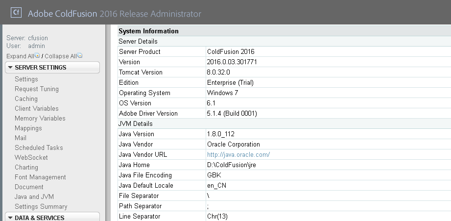
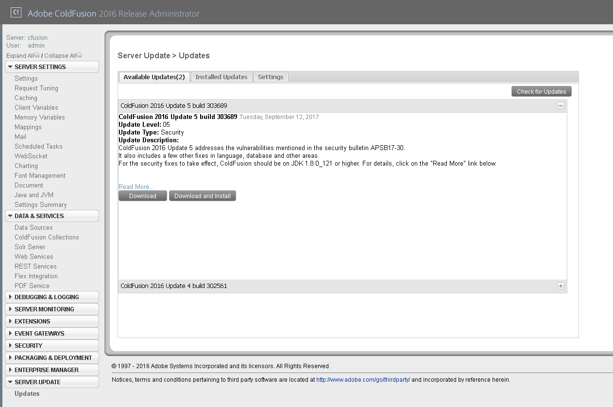
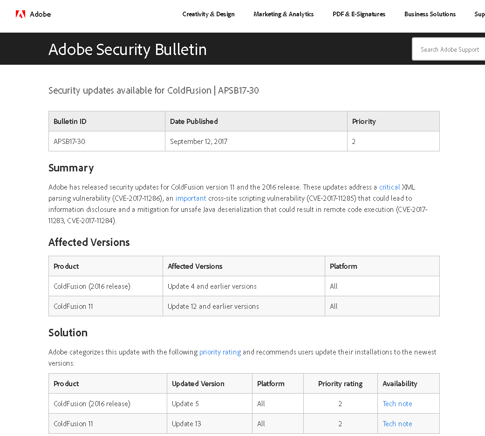
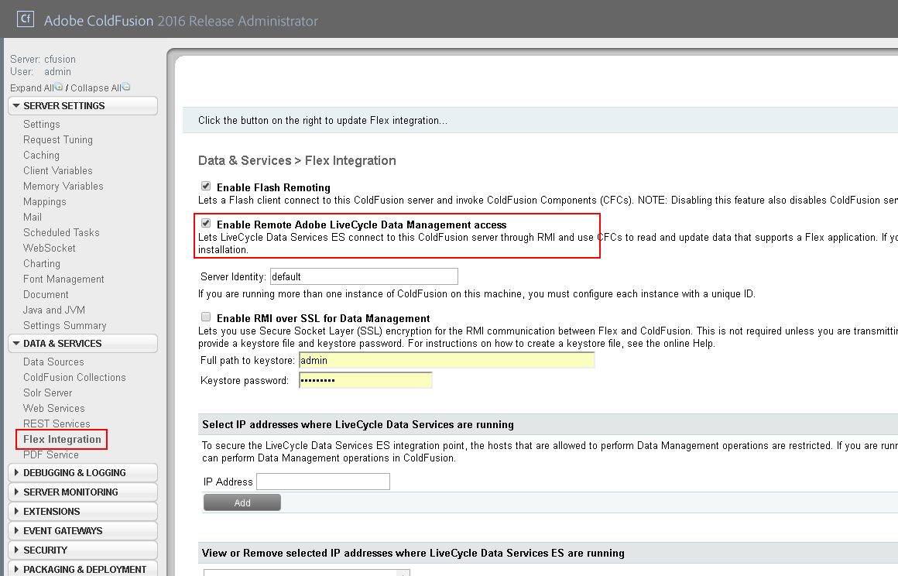
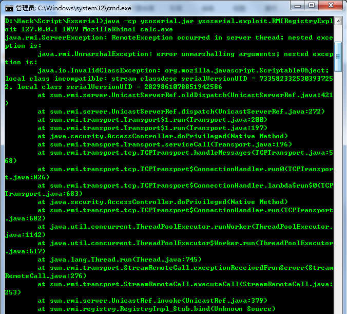
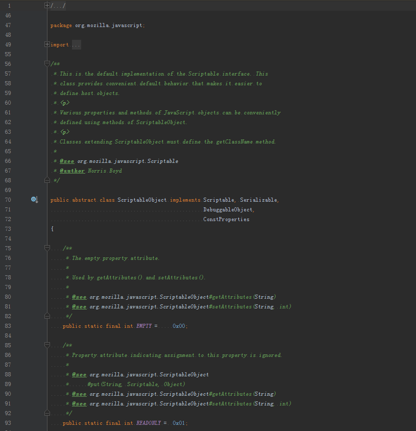
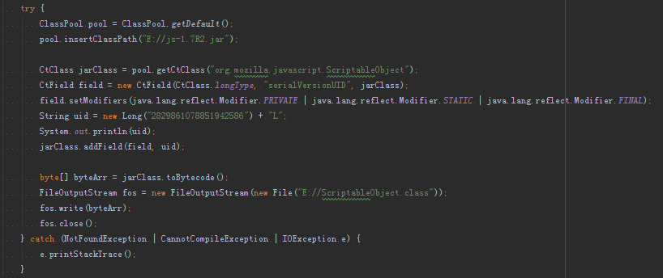
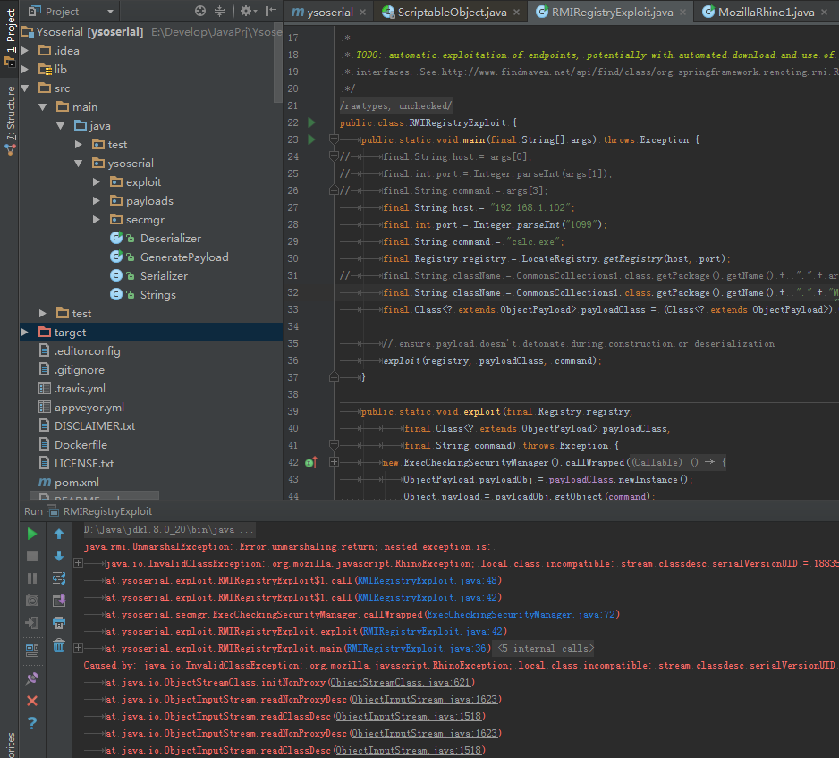
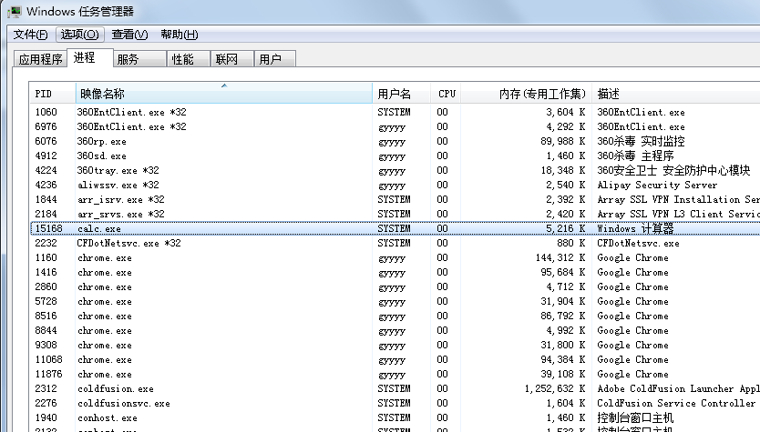
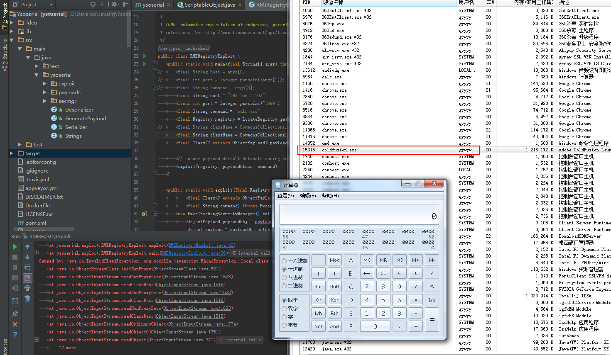

# ColdFusion反序列化（CVE-2017-11283&11284）漏洞分析

## 漏洞编号

CVE-2017-11283 & CVE-2017-11284

## 漏洞介绍

根据漏洞作者博客中的描述，他发现CodeFusion的RMI服务 *（默认端口1099）* 未对请求的对象类型进行校验，可能存在反序列化漏洞，而且CodeFusion中依赖了lib/js.jar *（Mozilla Rhino JavaScript library）* ，可以构造出稳定的反序列化POP链。

## 环境搭建

官方下载试用版 *（不是最新版，未修复漏洞）*，正常安装。

更新提示中的版本才为修复后版本。

开启RMI服务，并且确认1099端口正常启动。

## 构造PoC

直接通过ysoserial工具 *（使用方式参考官方手册即可）* 利用，很可惜不成功。

注意观察报错信息 *（当然漏洞作者也在博客里有说明，可以仔细看看）* ，很明显是因为服务端和客户端的`serialVersionUID`不一致 *（一般为版本或其他编译环境问题）* 。

进入ysoserial的rhino:js:1.7R2/js-1.7R2.jar *（Maven管理的，即Mozilla Rhino）* 中找到ScriptableObject类看看，发现它并没有显式的定义自己的`serialVersionUID`。

这时候的做法有3种：

1.拿到生成的Payload，找到对应的`serialVersionUID`，将它改成和服务端一致，再编写脚本或其他方式自行发包
1.拦截TCP请求，修改对应的`serialVersionUID`值，再放行
1.修改js-1.7R2.jar，为ScriptableObject类显式定义`serialVersionUID`并赋值

前两种做法问题应该不大，我们重点测试第三种。

由于js-1.7R2.jar版本有点老 *（2009年）* ，依赖的编译环境不是特别好匹配 *（JDK1.5和老版本的Ant）* ，因此我们直接使用javaassist对ScriptableObject.class进行字节码操作。

将重新生成的ScriptableObject.class替换掉js-1.7R2.jar中修改之前的版本 *（当然你也可以选择直接write）* 。

用新的jar包生成Payload进行测试，会发现IdScriptableObject也存在一样的问题，重复上面的工作就行了。

再次测试，出现的RhinoException不一致可以忽略，那已经是回包了。

## 复现验证

测试结果除了报RhinoException的错，仍然没有弹出计算器。

别急，让我们看看进程。

因为在安装ColdFusion时被做成了服务由SYSTEM启动 *（见上图ColdFusion相关进程）* ，和我们当前用户不交互。

那我们手动启动一次，再试试。

