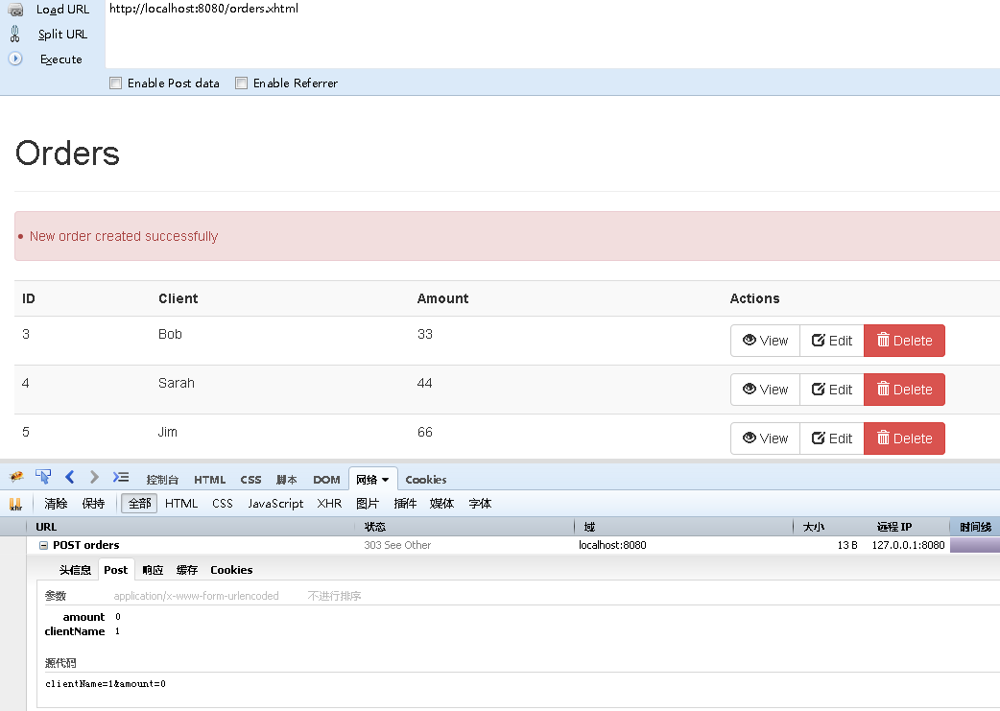
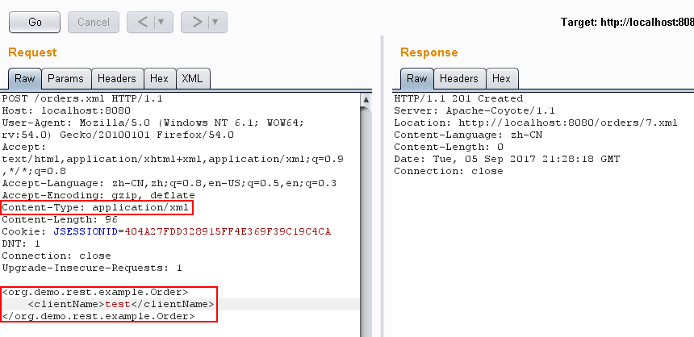

# Struts2远程代码执行（S2-052）漏洞分析


## 漏洞编号

CVE-2017-9805

## 漏洞介绍

根据漏洞作者博客中的描述，问题出现在struts2-rest-plugin插件`XStreamHandler`中的`toObject()`方法，其中未对传入的值进行任何限制，在使用XStream反序列化转换成对象时，导致任意代码执行漏洞。

## 环境搭建

直接部署struts-2.5.12-all中的struts2-rest-showcase项目即可，从下图可以看出，插件的默认配置支持XML扩展。


运行看看，默认的是XHTML扩展。



转换成XML请求也是成功的，但是注意Content-Type需要改成application/xml类型。



## 构造PoC

用[marshalsec工具](https://github.com/mbechler/marshalsec)生成Payload，工具简单使用方式如下：

```shell
java -cp marshalsec-0.0.1-SNAPSHOT-all.jar marshalsec.<Marshaller> [-a] [-v] [-t] [<gadget_type> [<arguments...>]]
```

看看工具作者的Paper，针对XStream支持很多种Payload，找一个Struts2也支持的即可。


本文选择的是ImageIO，对应的gadget_type可以通过查看marshalsec的源码得到。


生成Payload。


## 复现验证

