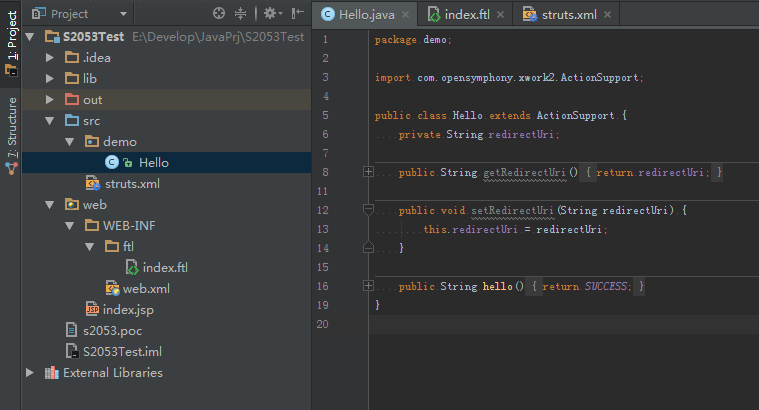
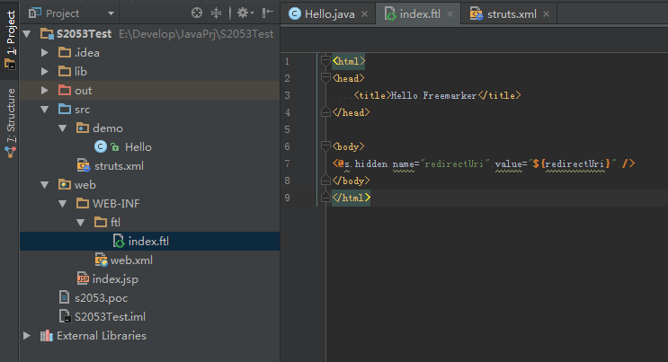
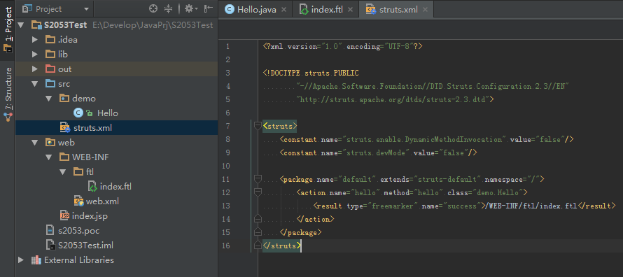
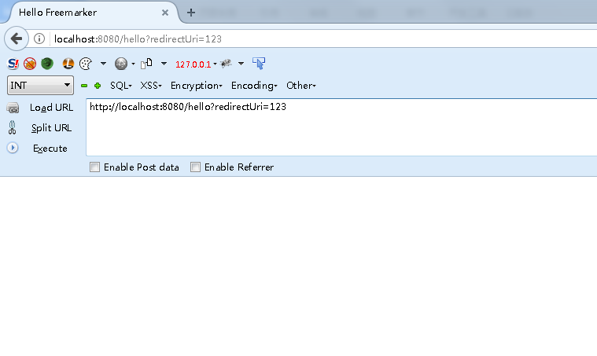
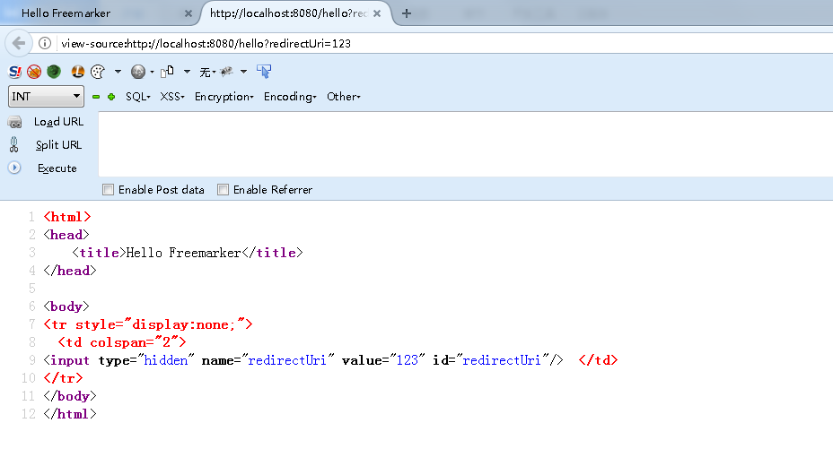
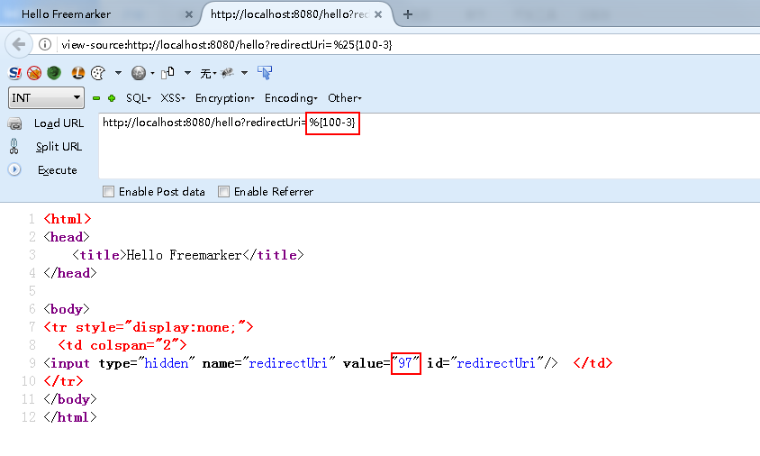
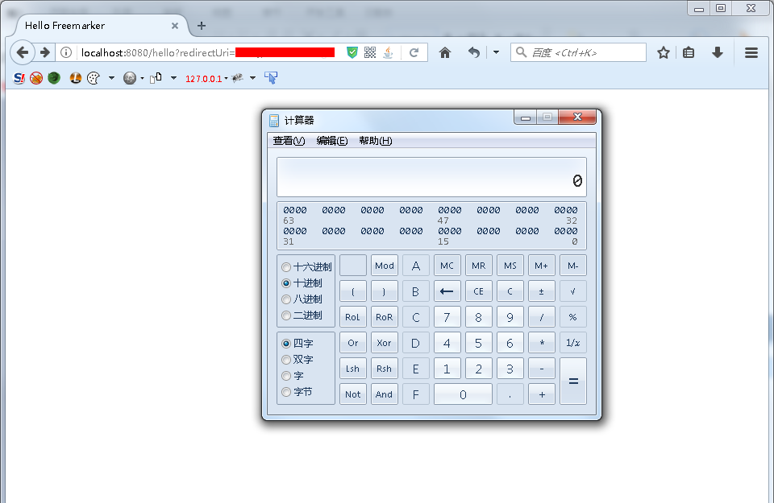
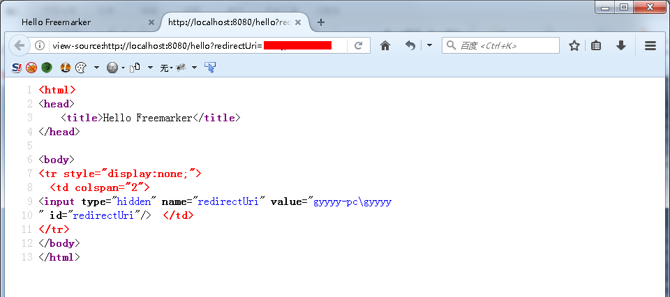

# Struts2远程代码执行（S2-053）漏洞分析

## 漏洞编号

CVE-2017-12611

## 搭建环境

先用struts-2.3.33搭一个freemarker的简单项目 *（官方推荐的min-lib中就带了freemarker-2.3.22.jar，不用再额外去找了）* ，就用漏洞公告里给的那个写法。

运行看看，啥也没有。

别急，我们用的是hidden，看看网页源代码。

根据经验，应该是二次解析造成的漏洞，输入`%{100-3}`验证一下。

## 构造PoC

简单分析下，熟悉Struts2的同学应该可以想到了，Struts2的invocation会在跑遍一圈interceptor之后，进行execute result。

而我们项目中配置的result的type是freemarker，因此会这个流程会交到`FreemarkerResult`手里，它会把对应的.ftl模板拿出来各种处理。

这里会进行第一次解析，标签value属性的值将会变成我们传入的`%{100-3}`，当然其中还有OGNL进行get value的过程，这里就不细讲了。

之后标签处理结束前会回调给`UIBean`，它`end()`的时候肯定需要计算一下参数值，才能得到真正输出到浏览器上的值，这就会产生第二次解析。

所以，把S2-045的Payload稍微改改就能用了。

## 复现验证

国际惯例，弹个计算器。

再执行个系统命令`whoami`。

