# Struts2远程代码执行（S2-057）漏洞分析

### 漏洞编号

CVE-2018-11776

&nbsp;

### 补丁分析

在github上进行Tag对比。

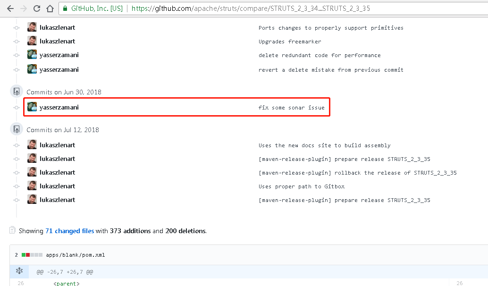

分析patch，定位[问题点](https://github.com/apache/struts/commit/918182344cc97515353cc3dcb09b9fce19c739c0)。

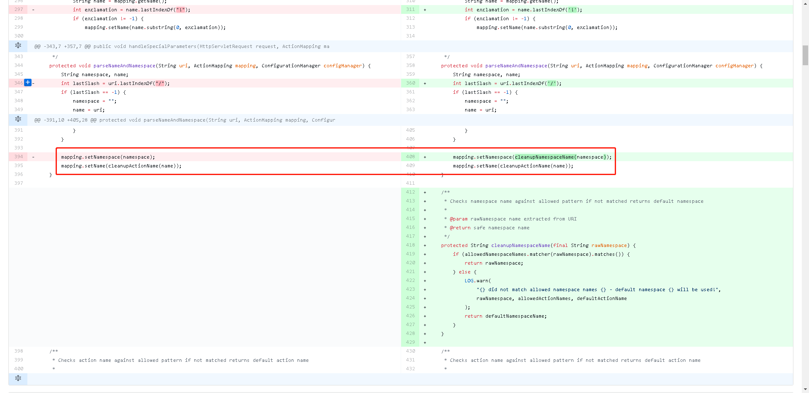

&nbsp;

### 环境搭建

根据漏洞作者的博客描述，直接使用Struts2-2.3.34的showcase项目，修改struts-actionchaining.xml。

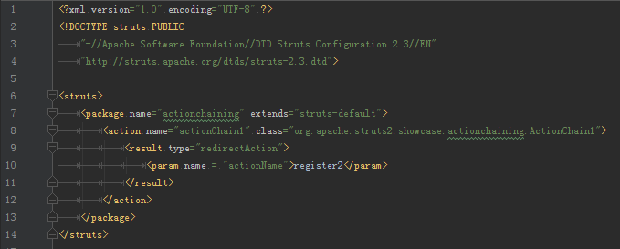

使用`${1+1}`验证漏洞存在。

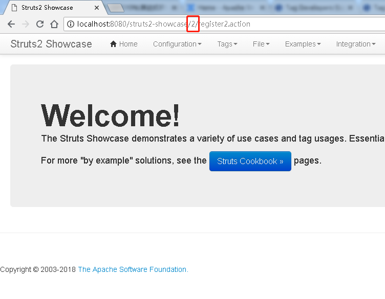

&nbsp;

### 漏洞分析

`DefaultActionMapper`调用`parseNameAndNamespace()`解析`namespace`和`name`。当`alwaysSelectFullNamespace`为`true`时，`namespace`的值可以通过URL控制。

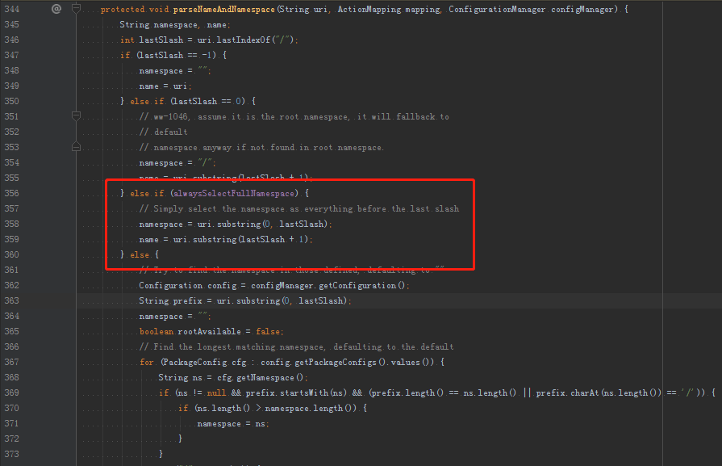

Action执行结束时，调用`ServletActionRedirectResult.execute()`进行重定向Result的解析，通过`ActionMapper.getUriFromActionMapping()`重组`namespace`和`name`后，由`setLocation()`将带`namespace`的`location`放入父类`StrutsResultSupport`中。

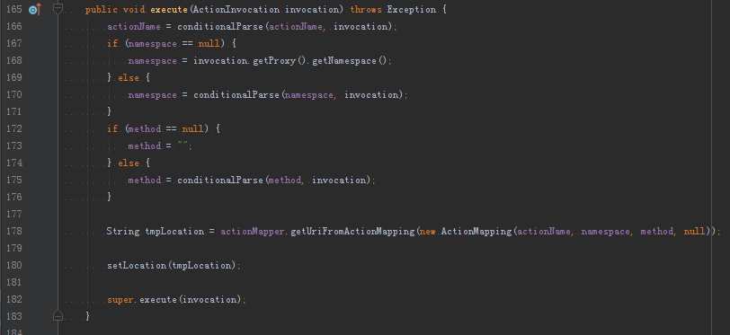

`StrutsResultSupport`拿到`location`后，通过`TextParseUtil.translateVariables()`调用`OgnlTextParser.evaluate()`解析执行URL中的OGNL表达式，导致代码执行。

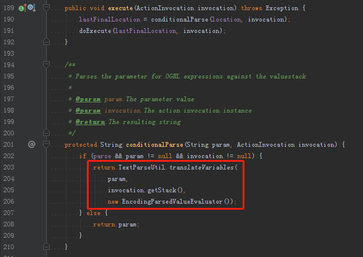

&nbsp;

### 利用条件

最小条件：

1. `alwaysSelectFullNamespace`值为`true`
1. Struts2配置文件中，`action`元素未设置`namespace`属性，或使用了通配符

漏洞场景：

- 在Struts2配置文件中，对未正确配置的action元素提供如下三类返回元素：
    1. Redirect Action
    1. Action Chaining
    1. Postback Result

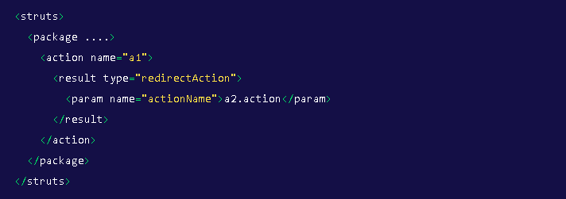

- 在模板中使用url元素标记：

&nbsp;

### 构造PoC

使用Struts2老版本的PoC无法正常弹出计算器，会在获取`#context`时得到`null`值，导致`['com.opensymphony.xwork2.ActionContext.container']`求值时的`source`为空，抛出异常。

通过跟踪OGNL底层代码发现，在比较新的版本的OGNL包中，`OgnlContext`移除了`CONTEXT_CONTEXT_KEY`、`CLASS_RESOLVER_CONTEXT_KEY`和`MEMBER_ACCESS_CONTEXT_KEY`，使OGNL表达式无法继续使用`#context`、`#_classResolver`和`#_memberAccess`来获得相应对象。

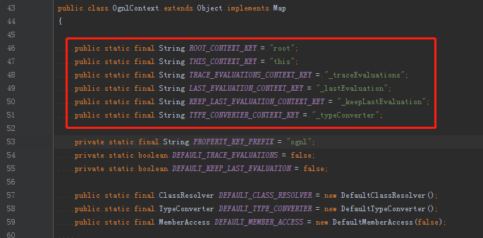
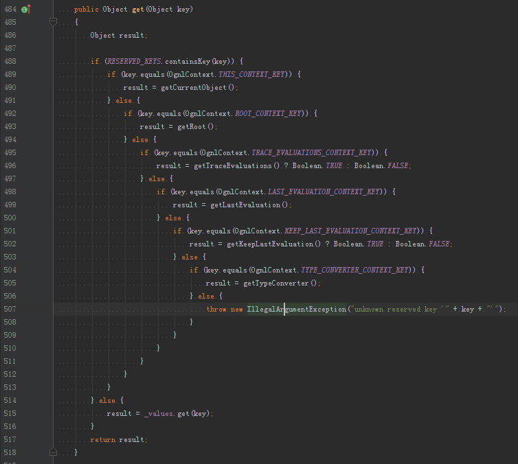

获取不到`context`就无法进行后续Struts2的沙盒绕过。通过分析，发现在`#request`域下的`struts.valueStack`对象中存在`context`属性，因此对S2-045的Payload进行一下简单改造即可。

成功弹出计算器。

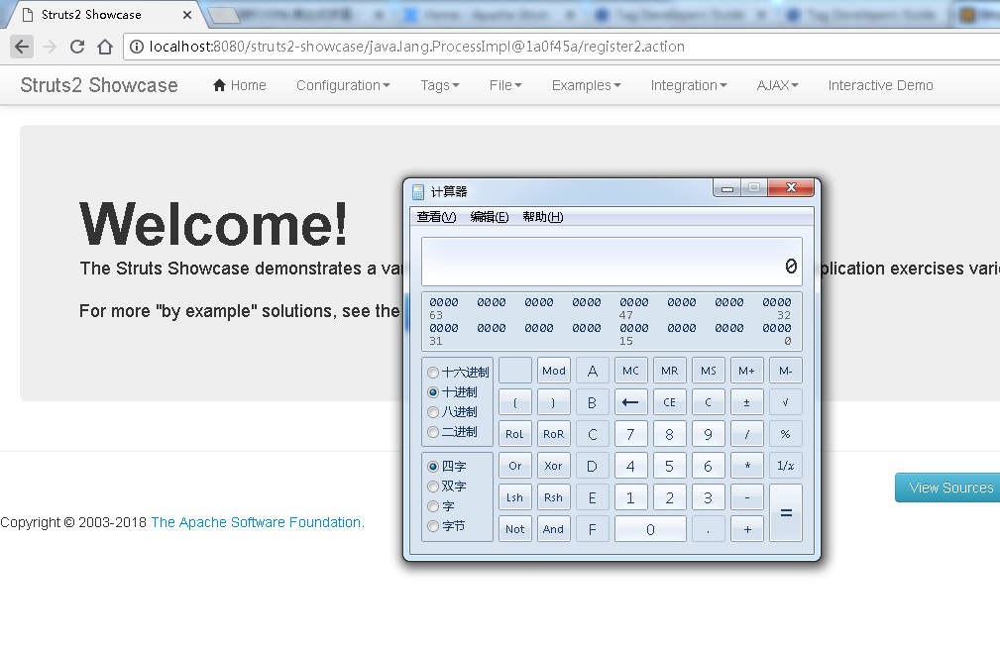

另外，由于Struts2.5中，几个excluded的map使用的是immutable collection，不允许修改，因此该PoC只适用于Struts2.3环境。_（2.5可以尝试使用`setXXX()`覆盖map值。）_

再多说一嘴，Struts2的showcase项目没有通过大家知道的`struts.mapper.alwaysSelectFullNamespace`配置项控制`alwaysSelectFullNamespace`的值，而是通过`@Inject`进行了IoC。

&nbsp;

### 参考

1. [Apache Struts2 S2-057](https://cwiki.apache.org/confluence/display/WW/S2-057)
1. [CVE-2018-11776: How to find 5 RCEs in Apache Struts with Semmle QL](https://lgtm.com/blog/apache_struts_CVE-2018-11776)
1. [Semmle Discovers Critical Remote Code Execution Vulnerability in Apache Struts (CVE-2018-11776)](https://semmle.com/news/apache-struts-CVE-2018-11776)
