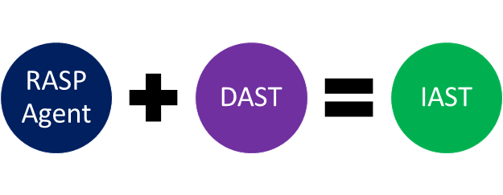

# Web应用安全测试技术备忘

* 最近在做灰盒测试相关的研究时，学习了一些圈内主流的测试技术方案，整理记录在这里预防自己的健忘症。刚巧在文章完成之日也看到[@张欧](https://security.alipay.com/对不起我不知道大佬的主页)大佬在SSC的议题《IAST交互式应用安全测试技术实践》，对自动化安全测试方向感兴趣的小伙伴可以多关注交流。 

## 主流测试技术

1. Static Application Security Testing *（SAST）*
    - 静态应用安全测试，又称静态程序分析，是一种白盒测试技术
    - 在应用启动前，通过检查应用的源代码或字节码，以确定是否存在安全问题
    - 经常被用于实现源代码分析工具
1. Dynamic Application Security Testing *（DAST）*
    - 动态应用安全测试，是一种黑盒测试技术
    - 在应用运行时，通过检查应用暴露在外的接口，来发现外部可见的安全问题
    - 经常被用于实现漏洞扫描/检测工具
1. Interactive Application Security Testing *（IAST）*
    - 交互式应用安全测试，是一种灰盒测试技术
    - 结合SAST和DAST的优点，在模拟黑客外部攻击的同时，对内部实时数据进行监视，提高测试精度
    - 被Gartner称为『next-generation modern web and mobile applications require a combination of SAST and DAST techniques』
    - 被很多大佬用于实现自动化漏洞挖掘工具，甚至甲方企业级应用安全审计工具，很多漏洞扫描工具也逐渐向此技术架构进行迁移

## DAST vs. SAST

所有安全测试最重要的属性之一就是覆盖率。

### 技术覆盖

SAST不仅需要支持各种语言 *（Java、C#、PHP、Python等）* ，还可能需要支持各种框架的封装特性。

DAST在很大程度上则是独立于应用所使用的技术的，仅仅依赖HTTP或其他网络协议即可将数据发送到目标内部。

### 应用覆盖

DAST依赖于暴露URL和输入的发现，来尽可能多的为测试提供攻击面。

SAST则更专注于应用内部中调用关系、控制流程，以及数据流向，对于逻辑分支的覆盖率更具优势。

## IAST vs. SAST and DAST

DAST被圈内一致诟病的问题是它的误报较高 *（攻击结果判定也是一个值得研究课题）*。

SAST误报率低，而且可以非常直观的提示开发者缺陷位置，但它对于应用的业务逻辑、第三方组件使用，以及各种不安全配置的检测能力却稍显不足。

于是IAST出现了。

### IAST是如何工作的

目前主流的IAST技术实现有两种方式：

1. Active IAST *（主动型）*

    一个组件产生恶意流量，另一个组件在运行时监视应用

1. Passive IAST *（被动型）*

    仅在运行时监视应用

对于运行时监视应用这个需求，很容易就能联想到RASP技术。没错，主动型IAST正是DAST和RASP技术相结合的产物：

RASP作为运行时代理实时分析DAST模拟攻击产生的恶意流量在应用内部所造成的影响 *（如跟踪用户输入，从它进入应用，到作为查询语句的一部分进入数据库查询，得到数据集结果，最后封装成响应数据返回给终端用户）* ，以及跟踪相关代码，提供漏洞在代码中的准确位置。

结合RASP，IAST可以监视应用进程中代码执行过程和内存中发生的所有事情：

- HTTP请求响应
- 代码级数据流
- 数据库查询 *（如ODBC）* 、目录查询 *（如LDAP）* 、文件系统访问
- 字符串操作
- 内存中的数据栈
- 调用第三方库
- 调用外部应用或服务
- 执行特定代码
- ...

### IAST的优势

- RASP通过提供应用内部数据流的代码级可见性，使DAST结果更具可控性
- RASP通过提供攻击结果判定证据，降低DAST结果的误报率
- RASP通过提供应用内部指令栈，使开发者能够快速准确的定位漏洞并进行修复
- DAST通过模拟攻击，可以反向验证RASP的检测和保护能力

## 说在最后的话

IAST也不是银弹。一个有效的应用安全解决方案不会依赖于单一的测试技术，而是在整个SDLC中结合多种测试技术的优势。

例如，在开发阶段使用SAST分析源代码，报告其中存在的漏洞，制定并实施缓解方案。在测试阶段使用IAST模拟攻击，分析应用的内部行为，确定应用在生产环境中可能面临的风险。最后，在生产阶段使用RASP实时监控，通过告警持续响应所有被识别的攻击。

这些技术共同构成了漏洞检测和保护的综合策略。

## 参考

1. [I Understand SAST and DAST but What is IAST](https://www.contrastsecurity.com/security-influencers/question-i-understand-sast-and-dast-and-how-to-use-them-but-what-is-iast-and-why-does-it-matter)
1. [What is IAST](https://www.veracode.com/security/interactive-application-security-testing-iast)