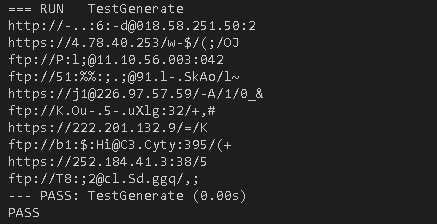
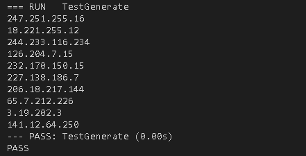
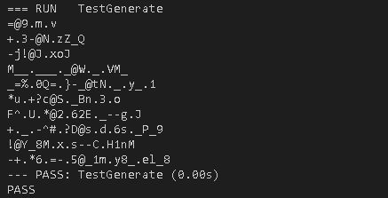
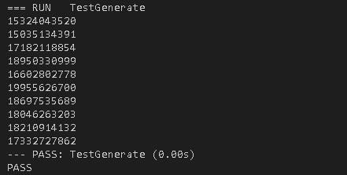
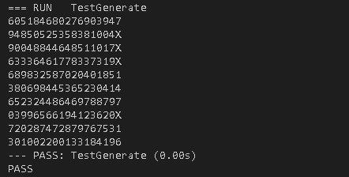
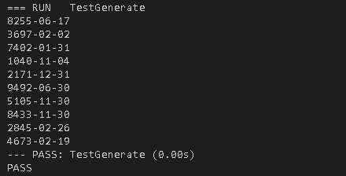
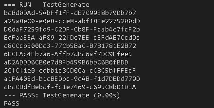

# 正则表达式反向生成器，Go语言实战


<sub>* 在开发扫描器或Fuzzer之类的工具时，可能会遇到一个特殊需求，需要根据已知的正则表达式反向随机或全量生成其对应的字符串，Python中有个xeger库可以完成这件事。由于我之前介绍DNS协议解析的[文章](../2017/head-first-golang-with-dns-parser.md)中已经顺带过了一遍Go的基础知识，所以本文将带着大家实现一个简单的Go版xeger。</sub>

## 用户故事

> 作为使用者，我希望在提供一条正则表达式后，获得一个满足这个表达式匹配的字符串。我可以用来生成一些基于正则表达式的规则的测试用例。

约束条件：

1. 提供的表达式需要符合正则表达式语法规范
1. 当表达式中存在取任意字符时，尽可能返回ASCII中可打印的字符

## 解析表达式

关于正则表达式的语法解析，可以使用Go官方包`regexp/syntax`中的`Parse()`函数来实现 *（对解析过程感兴趣的小伙伴可直接阅读相应源代码）* ，它会返回一个`syntax.Regexp`对象的引用。由于Go和Python一样，默认使用Perl风格的正则表达式模式，所以可以指定`Parse()`函数的`flags`参数为`syntax.Perl`：

```go
syntax.Parse(r, syntax.Perl)
```

在解析之前，需要判断一下传入的表达式的有效性。将整个过程封装成一个`parse()`函数，完整代码如下：

```go
func parse(r string) (*syntax.Regexp, error) {
    _, err := regexp.Compile(r)
    if err != nil {
        return nil, err
    }
    return syntax.Parse(r, syntax.Perl)
}
```

## 生成字符串

表达式的值在`syntax.Regexp`对象中是用`rune`类型 *（可看作Unicode）* 表示的，因此可以定义一个`byte`类型的缓冲区来临时存放生成过程的值：

```go
var buf bytes.Buffer
```

在接下来的解析中，只需要拿`buf`的指针传入字符串生成函数更新其中的值，最后调用它的`String()`方法转换成字符串输出即可。

字符串生成函数`generate()`很简单，就是根据每个`sub`的运算类型，用一个大大的`switch-case`语句块包裹进行分支处理：

```go
func generate(buf *bytes.Buffer, re *syntax.Regexp) {
    switch re.Op {
    case SomeOp:
        // generate characters
    }
}
```

接下来将详细介绍Go定义的正则表达式中各种运算类型和对应的处理过程。

### `OpNoMatch`和`OpEmptyMatch`

- `OpNoMatch`

    无字符串匹配，如`[^\x00-\x{10FFFF}]` *（其中`0x10FFFF`是Unicode的编码范围上限）*

- `OpEmptyMatch`

    空字符串匹配，如`(?:)`

不需要生成任何的字符表示，可忽略。

### `OpLiteral`

普通字符串匹配，如`abc`或`(?i:abc)`。

不需要多余处理，直接将字符串原文 *（`syntax.Regexp`的`Rune`属性值）* 放入缓冲区：

```go
case syntax.OpLiteral:
    for _, r := range re.Rune {
        buf.WriteRune(r)
    }
```

### `OpCharClass`

字符选择匹配，如`[a-z]`或`[^a-z]`。

由于Go的正则表达式解析器会将选择范围解析成成对的数组 *（如`[a-z0-9]`会解析为`[a, z, 0, 9]`）* ，因此只需要以2个元素一组为上下边界，随机生成一个其中的字符，边界尽量控制在可打印字符范围内：

```go
case syntax.OpCharClass:
    if len(re.Rune)%2 != 0 || len(re.Rune) == 0 {
        break
    } else {
        if re.Rune[0] == 0 && re.Rune[len(re.Rune)-1] == unicode.MaxRune { // [^a-z], replace with ascii printable characters
            if re.Rune[1] >= 0x20 {
                re.Rune[0] = 0x20
            }
            if re.Rune[len(re.Rune)-2] <= 0x7e {
                re.Rune[len(re.Rune)-1] = 0x7e
            }
        }
        r := make([]rune, len(re.Rune)/2)
        for i := 0; i < len(re.Rune); i += 2 {
            lo, hi := re.Rune[i], re.Rune[i+1]
            n := lo
            if lo < hi {
                n = rune(x.intn(int(hi-lo)+1) + int(lo))
            }
            r[i/2] = n
        }
        x.b.WriteRune(r[x.intn(len(r))])
    }
```

### `OpAnyCharNotNL`和`OpAnyChar`

- `OpAnyCharNotNL`

    任意字符匹配，不包含换行符，如`(?-s:.)`。

- `OpAnyChar`

    任意字符匹配，如`(?s:.)`。

随机生成一个换行符以外的可打印字符：

```go
case syntax.OpAnyCharNotNL, syntax.OpAnyChar:
    buf.WriteRune(rune(rand.Intn(0x5f) + 0x20))
```

### `OpBeginLine`、`OpEndLine`、`OpBeginText`和`OpEndText`

- `OpBeginLine`

    行首匹配，如`^`

- `OpEndLine`

    行尾匹配，如`$`

- `OpBeginText`

    文首匹配，如`\A`

- `OpEndText`

    文尾匹配，如`$`或`\z`

不需要生成任何的字符表示，可忽略。

### `OpWordBoundary`和`OpNoWordBoundary`

- `OpWordBoundary`

    单词边界匹配，如`\b`

- `OpNoWordBoundary`

    非单词边界匹配，如`\B`

其中`OpNoWordBoundary`不需要生成任何的字符表示，可忽略。`OpWordBoundary`可随机生成一个非`\w`或`\W`的字符，或直接使用`[空格]`代替：

```go
case syntax.OpWordBoundary:
    buf.WriteRune(0x20)
```

### `OpCapture`

匹配捕获，如`(abc)`。

当前类型不需要多余处理，但需要递归处理它`Sub`的值：

```go
case syntax.OpCapture:
    generate(buf, re.Sub[0])
```

### `OpStar`、`OpPlus`、`OpQuest`和`OpRepeat`

- `OpStar`

    指定字符匹配，可重复0次以上，如`a*`

- `OpPlus`

    指定字符匹配，可重复1次以上，如`a+`

- `OpQuest`

    指定字符匹配，可出现0或1次，如`a?`

- `OpRepeat`

    指定字符匹配，可重复指定范围内次数，如`a{2}`、`a{2,}`或`a{2,5}`

随机或按指定次数循环生成字符原文，若次数未受限制，则控制在3次以内：

```go
case syntax.OpStar:
    for i := 0; i < rand.Intn(4); i++ {
        generate(buf, re.Sub[0])
    }
case syntax.OpPlus:
    for i := 0; i < rand.Intn(3)+1; i++ {
        generate(buf, re.Sub[0])
    }
case syntax.OpQuest:
    if rand.Intn(2) == 1 {
        generate(buf, re.Sub[0])
    }
case syntax.OpRepeat:
    min, max := re.Min, re.Max
    n := 0
    if max < 0 {
        n = rand.Intn(4)
    } else if min < max {
        n = rand.Intn(max - min + 1)
    }
    for i := 0; i < min+n; i++ {
        generate(buf, re.Sub[0])
    }
```

### `OpConcat`

多个子表达式连接匹配，如``[a-z]+[0-9]*``。

遍历子表达式进行递归处理：

```go
case syntax.OpConcat:
    for _, sub := range re.Sub {
        generate(buf, sub)
    }
```

### `OpAlternate`

多个子表达式选择匹配，如`(abc|xyz)`。

随机选择一个子表达式递归处理：

```go
case syntax.OpAlternate:
    if len(re.Sub) <= 1 {
        break
    }
    generate(buf, re.Sub[rand.Intn(len(re.Sub))])
```

将所有`case`放入`generate()`方法的`switch`块中，一个正则表达式反向生成器就基本完成了。

## 测试

在互联网上找几个常用的正则表达式测试一下生成器的效果。

### URL地址

`(http|ftp|https):\/\/[\w\-_]+(\.[\w\-_]+)+([\w\-\.,@?^=%&:/~\+#]*[\w\-\@?^=%&/~\+#])?`



### IP地址

`(((\d{1,2})|(1\d{1,2})|(2[0-4]\d)|(25[0-5]))\.){3}((\d{1,2})|(1\d{1,2})|(2[0-4]\d)|(25[0-5]))`



### E-Mail地址

`[\w!#$%&'*+/=?^_{|}~-]+(?:\.[\w!#$%&'*+/=?^_{|}~-]+)*@(?:[\w](?:[\w-]*[\w])?\.)+[\w](?:[\w-]*[\w])?`



### 电话号码

`(13[0-9]|14[579]|15[0-35-9]|16[6]|17[0135678]|18[0-9]|19[89])\d{8}`



### 身份证

`(\d{6})(\d{4})(\d{2})(\d{2})(\d{3})([0-9]|X)`



### 日期时间

`([0-9]{3}[1-9]|[0-9]{2}[1-9][0-9]{1}|[0-9]{1}[1-9][0-9]{2}|[1-9][0-9]{3})-(((0[13578]|1[02])-(0[1-9]|[12][0-9]|3[01]))|((0[469]|11)-(0[1-9]|[12][0-9]|30))|(02-(0[1-9]|[1][0-9]|2[0-8])))`



### GUID

`[0-9a-fA-F]{8}[-]?([0-9a-fA-F]{4}[-]?){3}[0-9a-fA-F]{12}`



## 参考

1. [Regex Cheat Sheet](http://www.regexlib.com/CheatSheet.aspx)