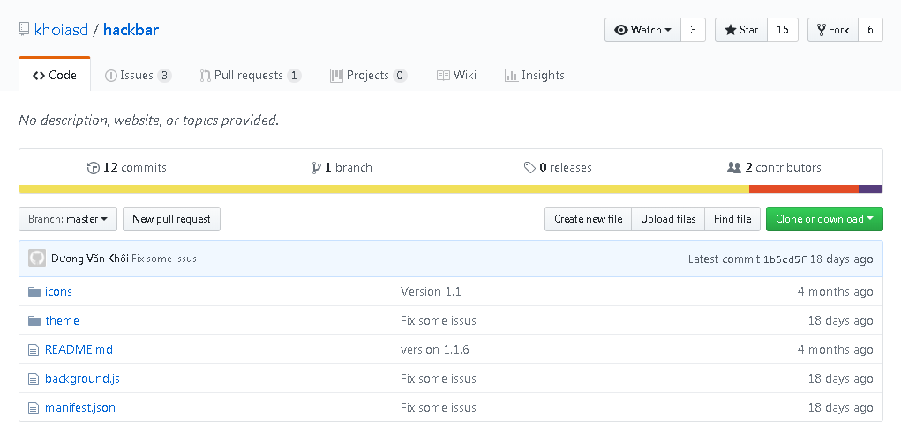
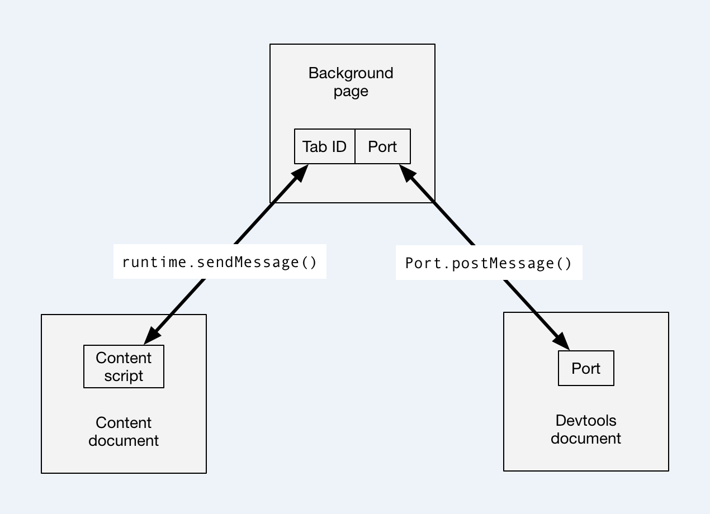

# 深入浅出WebExtensions（上）


<sub>* 不久前，实验室大佬[@sm0nk](http://www.cnblogs.com/shellr00t/)在xKongfoo上做了一次接口安全相关议题的演讲，在和[@浮萍](http://fuping.site/)研究BurpSuite插件开发为其做准备的时候，发现其中的部分需求和年初空闲时自己一直在玩的Web代理有一部分类似，不记得什么原因又碰巧接触了Firefox的扩展，于是边学习边尝试写了些小玩意，感兴趣的同学就跟着我的文章一起入个门吧。</sub>

## 说在前面的话

提起浏览器扩展 *（又叫附加组件）* ，工作中经常会用到的有Firebug、Hackbar、Postman、TamperData、ModHeader等。

在15年左右，Mozilla官方宣布Firefox将淘汰已有的Add-On而引入Chrome的WebExtensions扩展技术。至今为止，Chrome、Firefox、Edge、Opera等主流浏览器都支持WebExtensions扩展。

虽然这个消息和我们并没有半毛钱关系，但不幸的是Hackbar在新版Firefox中用不了了 *（不过后来冒出来一堆）* 。

所以我们得学会它，以后自己写:)。

本文将以Firefox扩展为例，分上下两篇来介绍WebExtensions开发技巧。上篇以Github上一个开源的Hackbar *（不知道是不是真的）* 源代码分析为主线，串讲WebExtensions基础知识及其API；下篇则会运用这些内容实战一个小插件 *（随缘更新，佛系编程）* 。

用了这么久的Hackbar会不会好奇它是怎么实现的？别着急，马上进入正题。

## 什么是WebExtensions

简单来说，WebExtensions就是一个用于开发浏览器扩展的技术，开发人员仅需要掌握HTML、CSS、JavaScript即可使用它来开发浏览器扩展。

使用WebExtensions可以很方便的开发出跨浏览器扩展 *（当然，各浏览器之间的API存在少量兼容问题）* 。

## Hackbar源代码分析

先放张图，看看[HackBar for Firefox Quantum](https://github.com/khoiasd/hackbar/)这个项目的目录结构 *（请忽略它少得可怜的Star数）* ：



### manifest.json

这是扩展中必不可少的文件，固定放在项目根目录下，其中定义了扩展的名称、版本、作者、权限、各类脚本等信息。

```json
{
    "description": "A HackBar for new firefox (Firefox Quantum). This addon is writed in webextension and alternatives to the XUL version of origanal Hackbar.",
    "manifest_version": 2,
    "name": "HackBar",
    "version": "1.1.8",
    "author": "Khoiasd",
    "homepage_url": "https://github.com/khoiasd/hackbar",
    "icons": {
        "48": "icons/icon.png"
    },
    "permissions": ["tabs", "activeTab", "webRequest", "webRequestBlocking", "<all_urls>"],
    "devtools_page": "theme/hackbar.html",
    "background": {
        "scripts": ["background.js"]
    }
}
```

- `manifest_version`、`name`和`version`三个属性是强制要求的
- `permissions`属性指定了扩展所需要的[权限](https://developer.mozilla.org/en-US/Add-ons/WebExtensions/manifest.json/permission)，最后一个值`<all_urls>`表示匹配所有URL
- `devtools_page`属性指定了扩展中实现的开发者工具面板 *（打开浏览器按F12看看）*
- `background`属性指定了扩展引入的一个或多个后台脚本文件

还有一些比较常用的属性如下：

1. `applications`

    指定一个本地应用程序 *（是的，你没看错，浏览器扩展可以与本地应用程序直接通信，实现更强大的功能）*

1. `browser_action`

    浏览器工具栏按钮

1. `content_scripts`

    可以将指定的脚本文件加载到所有URL模式匹配的页面中

1. `options_ui`

    为扩展提供配置选项页面

1. `page_action`

    浏览器地址栏按钮

1. `sidebar_action`

    浏览器侧边栏面板

此外，还可以通过其他运行中脚本动态创建出更丰富的UI *（一部分需要配置额外权限）* :

1. `Context Menus`

    上下文 *（右键）* 菜单项

1. `Extension Pages`

    单独弹出的扩展页

1. `Notifications`

    通知消息

*（manifest.json其他相关内容请参考[官方文档](https://developer.mozilla.org/en-US/Add-ons/WebExtensions/manifest.json)）*

### 开发者工具面板

```html
<body>
    <div id="inner-html"></div>
    <script src="js/hackbar.js"></script>
</body>
```

- 第8行，引入一个JavaScript脚本hackbar.js

```js
browser.devtools.panels.create(
    "HackBar",
    "/icons/icon.png",
    "/theme/hackbar-panel.html"
);
```

- 第5行，调用`devtools.panels`API的`create()`创建一个面板UI *（可以创建多个，排排坐）*
- 第8行，指定面板UI的HTML文件为hackbar-panel.html *（这是用户真正可以肉眼看见的页面）*

对于hackbar-panel.html的一堆HTML以及它的CSS样式就不详细展开了，直接上张图看看最终效果：


```html
<script src="js/jquery-3.2.1.min.js"></script>
<script src="js/bootstrap.min.js"></script>
<script src="js/Encrypt.js"></script>
<script src="js/hackbar-panel.js"></script>
```

- 第120行，引入一个JavaScript脚本hackbar-panel.js

到此，一个开发者工具面板的创建就基本完成了，而hackbar-panel.js中的内容则承担了用户与扩展交互的全部工作。

接下来，本文将以功能的维度对Hackbar进行拆分，分别剖析其代码逻辑。

### Load URL

```js
function loadUrl() {
    sending = browser.runtime.sendMessage({
        tabId: browser.devtools.inspectedWindow.tabId,
        action: 'load_url'
    });
    sending.then(function(message){
        if (message.url){
            urlField.value = message.url;
        }
        if (message.data && postDataField.value == "") {
            postDataField.value = message.data;
        }
    });
}
```

- 第119行，Load URL按钮注册的click事件的回调函数定义
- 第120行，调用`runtime`API的`sendMessage()`向后台脚本发送一个一次性消息，消息参数格式为JSON，键值对自定义
- 第121行，通过`devtools.inspectedWindow`API的`tabId`属性，获取当前开发者工具面板对应的标签页ID
- 第124行，由于`sendMessage()`可以返回一个`Promise`对象，因此调用`then()`能够对其返回结果进行处理 *（也可以使用async/await的异步处理机制）*
- 第125-130行，将得到的URL和POST Data数据赋值给对应元素

```js
browser.runtime.onMessage.addListener(handleMessage);
```

- 第130行，调用`runtime`API注册一个`onMessage`事件的监听器，回调函数为`handleMessage()`

```js
case 'load_url':
    getCurrentTabUrl(sendResponse);
    break;
```

- 第116行，`handleMessage()`中当接收消息的`action`值为`load_url`时的分支
- 第117行，调用`getCurrentTabUrl()`处理

```js
function getCurrentTabUrl(sendResponse){
    browser.tabs.query({active:true, currentWindow:true}).then(tabs => {
        currentTabUrl = tabs[0].url;
        sendResponse({url: currentTabUrl, data: postDataCurrent});
    });
}
```

- 第32行，调用`tabs`API *（需要配置`tabs`权限）* 的`query()`获得符合条件的标签页集合 *（代码中条件为当前浏览器窗口和活动标签页）* ，并调用`then()`处理`query()`结果
- 第34行，调用`sendResponse()`返回一个`Promise`对象，参数格式与`sendMessage()`相同

这个功能中出现的`runtime`和`tabs`应该是扩展中使用频率最高的几个API了，大部分组件之间的通信都依靠它们 *（如果你只有一个单一组件自己跑着玩，那就当我没说）* 。

说到这，我们就来好好聊聊扩展的通信机制。

扩展的通信有两种：

1. 一次性的 **短连接**
    - 内容脚本和各类UI组件都可以通过`runtime`API的`sendMessage()`向后台脚本发送消息
    - 后台脚本只能通过`tabs`API的`sendMessage()`向指定标签页的内容脚本主动发送消息
1. 双方可主动断开的 **长连接**
    - 内容脚本和各类UI组件都可以通过`runtime`API的`connect()`向后台脚本发起连接
    - 后台脚本只能通过`tabs`API的`connect()`向指定标签页的内容脚本发起连接
    - 连接成功会返回一个`Port`对象，双方可以调用其`postMessage()`发送消息，参数格式与`sendMessage()`相同
    - 不同的是`postMessage()`不能返回`Promise`对象，因此消息发送方无法使用`then()`或`async/await`处理结果

官方文档中也有两张表格分别对短连接发送接收消息、长连接发起处理连接进行了简单说明，大致翻译一下加深印象：

短连接发送接收消息

||内容脚本|后台脚本|
|-|-|-|
|发送消息|`browser.runtime.sendMessage()`|`browser.tabs.sendMessage()`|
|接收消息|`browser.runtime.onMessage`|`browser.runtime.onMessage`|

长连接发起处理连接

|连接类型|发起连接|处理连接|
|-|-|-|
|后台脚本 -> 内容脚本|`tabs.connect()`|`runtime.onConnect`|
|内容脚本 -> 后台脚本|`runtime.connect()`|`runtime.onConnect`|
|扩展 -> 本地应用|`runtime.connectNative()`|不支持|
|扩展 -> 扩展|`runtime.connect()`|`runtime.onConnectExternal`|

再举个官方文档中的栗子捋一捋：



由于开发者工具面板的脚本是无法直接与内容脚本通信的，因此需要先与后台脚本建立长连接，再通过后台脚本将消息中转到内容脚本。

如果还有感觉头晕的同学，直接动手写一写就清楚了。

### Split URL

```js
function splitUrl(){
    var uri = currentFocusField.value;
    uri = uri.replace(new RegExp(/&/g), "\n&");
    uri = uri.replace(new RegExp(/\?/g), "\n?");
    currentFocusField.value = uri;
    return true;
}
```

这没啥好说的，就是将URL中所有`&`和`?`前面都加了一个`\n`。

### Execute

终于到重点了。

```js
if (!enablePostBtn.checked){
    browser.runtime.sendMessage({
        tabId: browser.devtools.inspectedWindow.tabId,
        action: 'send_requests',
        url: url,
        method: 'GET',
        refrerrer: refrerrer,
        user_agent: user_agent,
        cookie: cookie
    });
}else{
    if(!postDataField.value){
        return;
    }
    var postData = postDataField.value;
    //var contentType = getContenType(postData);
    browser.runtime.sendMessage({
        tabId: browser.devtools.inspectedWindow.tabId,
        action: 'send_requests',
        url: url,
        method: 'POST',
        data: postData,
        //content_type : contentType,
        refrerrer: refrerrer,
        user_agent: user_agent,
        cookie: cookie
    });
}
```

- 第170行，当`#enable_post_btn`未选中时，向后台脚本发送GET请求数据消息
- 第185行，当`#enable_post_btn`选中时，向后台脚本发送POST请求数据消息

```js
if(method == 'GET'){
    browser.tabs.update({url: url});
}else{
    var post_data = request.data;
    browser.tabs.executeScript(tabId, {code: 'var post_data = "'+ escape(post_data) +'"; var url = "'+ escape(url) +'"'}, function(){
        browser.tabs.executeScript(tabId, {file: 'theme/js/post_form.js'});
    });
}
```

- 第101行，`handleMessage()`中当接收消息的`action`值为`send_requests`时的分支
- 第102行，当请求方法为GET时，调用`tabs`API的`update()`更新当前活动标签页的`url`属性，该动作会重新发送请求导航至新的URL
- 第105行，当请求方法为其他时，调用`tabs`API的`executeScript()`向指定标签页注入JavaScript脚本代码 *（此处为定义了两个变量）*
- 第107行，`executeScript()`执行成功后调用定义的匿名回调函数又注入一个JavaScript脚本文件post_form.js

```js
var form = document.createElement("form");
form.setAttribute("method", "post");
form.setAttribute("action", unescape(url));
fields.forEach(function(f){
    var input = document.createElement("input");
    input.setAttribute("type", "hidden");
    input.setAttribute("name", f['name']);
    input.setAttribute("value", f['value']);
    form.appendChild(input);
})
document.body.appendChild(form);
form.submit();
```

- 第28-29行，在当前标签页的页面中追加一个Form表单，并调用`submit()`提交，完成POST请求

由于HTML的Form表单无法对请求头进行操作，因此，需要使用扩展中另外一个强大的API来实现，先看代码，稍后再做详细介绍：

```js
browser.webRequest.onBeforeSendHeaders.addListener(
    rewriteHeaders,
    {urls: ["<all_urls>"], types: ["main_frame"]},
    ["blocking", "requestHeaders"]
);
sendResponse({status: true});
```

- 第109行，在请求发起后，创建一个监听器来监听`webRequest`API的`onBeforeSendHeaders`事件 *（该事件会在执行请求头发送动作前触发，需要配置`webRequest`权限）*
- 第110行，回调`rewriteHeaders()`处理事件消息
- 第112行，指定额外选项，`blocking`可以允许你修改请求头数据 *（需要配置`webRequestBlocking`权限）* ，`requestHeaders`会让监听器接收到的事件消息对象中包含请求头数据

```js
if(refrerrer){
    index_referer = isExistHeaders('referer', e.requestHeaders);
    if(index_referer != -1){
        e.requestHeaders[index_referer].value = refrerrer;
    }else{
        e.requestHeaders.push({
            name: "Referer",
            value: refrerrer
        });
    }
}
```

- 第48-58行，如果存在待修改的Referer头 *（请忽略开发人员的笔误，反正HTTP协议里这个单词也写错了:P）* ，调用`isExistHeaders()`查找请求头数据中是否已存在，若存在就替换，否则压入一个新的， *（其他的User-Agent头和Cookie头也是同样的操作，不展开了）*

```js
browser.webRequest.onBeforeSendHeaders.removeListener(rewriteHeaders);
```

- 第83行，在请求头修改结束之后，移除`webRequest`API的`onBeforeSendHeaders`事件的监听器 *（也就是说，修改请求头动作只影响此次请求）*

有趣的是，在后台脚本初始化时，脚本中就会创建一个一直存在的事件监听器，用来监听发起请求的事件：

```js
browser.webRequest.onBeforeRequest.addListener(
    getPostData,
    {urls: ["<all_urls>"], types: ["main_frame"]},
    ["requestBody"]
);
```

- 第25行，创建`webRequest`API的`onBeforeRequest`事件的监听器
- 第26行，回调`getPostData()`处理事件消息
- 第28行，指定额外选项，`requestBody`会让监听器接收到的事件消息对象中包含请求体数据

```js
function getPostData(e) {
    if ( e.method == "POST" && e.requestBody ) {
        let rawData = e.requestBody.formData;
        postDataCurrent = "";
        for (let key in rawData) {
            if (rawData.hasOwnProperty(key)) {
                postDataCurrent = postDataCurrent + key + "=" + rawData[key] + "&";
            }
        }
        postDataCurrent = postDataCurrent.slice(0,-1); // remove last &
    }
}
```

- 第13-22行，当请求方法为POST且存在请求体时，获取当前请求体，遍历其中所有的键，将其拼接成一个字符串赋值给全局变量`postDataCurrent` *（每次POST请求都会覆盖原值）*

赋完值就结束了？卧槽，它记录我的POST数据干什么？不会留了个隐藏后门吧？

少年不要太多内心戏，请往上翻到Load URL功能中仔细看看`getCurrentTabUrl()`在回传的数据中`data`的值，开发人员只是想把你最后一次POST请求的数据还给你。因为如果加载的最近一次URL是个POST请求，那这请求体数据不就刚好是你想要的么。

也请不要怪我不早说，因为辛辛苦苦憋到现在，就是为了和上面修改请求头的代码片段一起，给你们准备好属于安全人员真正的大餐：`webRequest`API。

`webRequest`API包含从请求发起到响应结束过程中所有阶段的事件，官方文档中对它流程的描述如下：


官方文档中建议，当你需要修改请求响应数据时，可以在监听器中使用额外选项`blocking`，并监听以下事件：

1. 放弃请求
    - `onBeforeRequest`
    - `onBeforeSendHeaders`
    - `onAuthRequired`
1. 重定向请求
    - `onBeforeRequest`
    - `onHeadersReceived`
1. 修改请求头
    - `onBeforeSendHeaders`
1. 修改响应头
    - `onHeadersReceived`
1. 身份认证
    - `onAuthRequired`

以上列出的四个事件都可以在额外选项中增加`blocking`及对应数据来实现修改动作，用法与前面代码中出现过的`onBeforeRequest`、`onBeforeSendHeaders`一致。

不过很遗憾的是并不支持修改响应体，但响应体内容如果对之后的业务逻辑有影响，那在拿到响应之后直接通过内容脚本操作Web页面也是基本能够满足需求的。

## 浏览器扩展的优势和劣势

### 优势

1. 基于浏览器，近请求发起和响应接收端，基本无视HTTPS
1. 可以直接操作Web页面，如自定义或特殊加密暴力破解之类的场景，可通过注入JavaScript脚本完成

### 劣势

1. 跨平台的兼容性相对代理而言较差
1. 由于不是直接接收并处理请求响应数据，因此对于复杂功能的实现，流程会相对更复杂一些

## 结语

本文通过对Hackbar的源代码分析，大致介绍了WebExtensions技术在Firefox分支上的基础知识，希望对有需要的同学有所帮助，欢迎指正。

之后将会运用学到的这些技术，结合其他逻辑组件一起，完成一篇简单漏洞扫描器的实战开发文章，不过动笔时间不定。

感谢你的阅读。

## 参考

1. [HackBar for Firefox Quantum](https://github.com/khoiasd/hackbar/)
1. [WebExtensions Guide](https://developer.mozilla.org/en-US/Add-ons/WebExtensions)