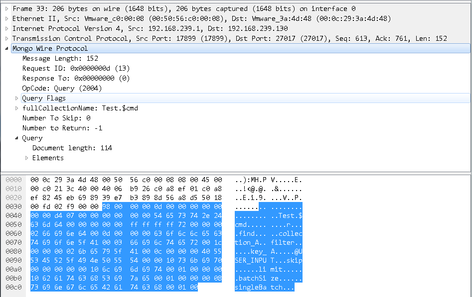

# 浅析SQL和NoSQL注入（下）


<sub>* [上回书说到](https://gyyyy.github.io/2017/11/23/sql-vs-nosql-injection-01/)，SQL注入（解析执行）过程涉及五个阶段，今天我们从这五个阶段继续对NoSQL注入进行分析。本文纯属个人扯淡，与技术无关。行文仓促，如有任何问题欢迎指正。</sub>

## 前面还有话

秉承前文的宗旨，本文依然不涉及任何NoSQL注入的实例和技巧。

如果大家想了解关于NoSQL注入 *（特别是MongoDB）* 的一些利用姿势，可以阅读我的好基友[@图南](https://x3fwy.bitcron.com/)之前写的[《谈谈我对NoSQL注入的一点研究》](https://pockr.org/activity/detail?activity_no=act_761e1e744d8aa16823#sp_26a751c506f61078b0) *（又名《冷门知识 — NoSQL注入知多少》）* 。

那让我们开始吧。

## 非关系型数据库NoSQL注入

目前对非关系型数据库的分类一般有以下四种：

1. Key-Value *（键值对）*

    代表：Redis、Memcached

1. Document-Oriented *（文档）*

    代表：MongoDB

1. Column-Family *（列族）*

    代表：HBase

1. Graph-Oriented *（图）*

    代表：Neo4J

由于每种类型的非关系型数据库区别较大，甚至同种类型的具体实现方案差别也不小，而很多NoSQL也不支持条件等高级查询方式，与本文的分析场景不太一致。因此，本文还是选择目前排名较高的非关系型数据库MongoDB *（3.6.2版本）* 进行分析。

假设我们的NoSQL长这样：

```nosql
db.collection_A.find({'key_A':@USER_INPUT})
```

### 客户端/服务器协议

老规矩，Wireshark先抓个包。



MongoDB的作者非常有良心，协议中就只定义了请求和响应两种类型的数据包，连握手都省了，客户端直接使用标准的TCP/IP Socket就可以连接。

根据[官方文档](https://docs.mongodb.com/manual/reference/mongodb-wire-protocol/)我们对查询请求流程涉及的协议做个简单解释。

数据包中的标准消息头结构定义如下：

```cpp
struct MsgHeader {
    int32   messageLength;
    int32   requestID;
    int32   responseTo;
    int32   opCode;
}
```

- `messageLength`为消息长度，也包含它自己的4个字节
- `requestID`为消息序列号
- `responseTo`为服务器响应的源请求消息序列号
- `opCode`为指令号，这里表示为`OP_QUERY`，其他指令请自查

而请求包中的完整消息结构定义也很简单 *（只以`OP_QUERY`为例）* ：

```cpp
struct OP_QUERY {
    MsgHeader header;
    int32     flags;
    cstring   fullCollectionName;
    int32     numberToSkip;
    int32     numberToReturn;
    document  query;
    [ document  returnFieldsSelector; ]
}
```

- `header`为消息头
- `flags`为查询请求相关的各标识位
- `fullCollectionName`为集合的完整名称
- `numberToSkip`为要忽略的文档数，从第一个文档 *（下标为0）* 开始
- `numberToReturn`为要返回的文档数，用于响应包，请求包中默认为-1
- `query`为查询条件，BSON类型
- `returnFieldsSelector`为返回文档中的限制字段，BSON类型，可选

终于 **不是普通明文字符串** 了。

### 关于BSON

那BSON是个啥？[BSON Spec](http://bsonspec.org/)官方是这样描述的：

> BSON *（Binary Serialized Document Format）* , short for Bin­ary JSON, is a bin­ary-en­coded seri­al­iz­a­tion of JSON-like doc­u­ments.

举个栗子：

```json
{ "key": "value" }
```

将它转换成BSON数据：

```plain
  0  1  2  3  4  5  6  7  8  9  0  1  2  3  4  5
+--+--+--+--+--+--+--+--+--+--+--+--+--+--+--+--+
|14 00 00 00|02|6b 65 79 00|06 00 00 00 76 61 6c|
+--+--+--+--+--+--+--+--+--+--+--+--+--+--+--+--+
|75 65 00|00|
+--+--+--+--+
```

- `14 00 00 00`为数据长度 *（含自身长度）*
- `02`为值类型，这里表示`string`类型
- `6b 65 79 00`为键，`cstring`类型
- `06 00 00 00 76 61 6c 75 65 00`为值 *（含4位长度和内容）*
- `00`为数据结束标识

其中，`cstring`类型的表现形式为`(byte*) 0x00`，而`string`类型的表现形式为`int32 (byte*) 0x00` *（长度不含自身，其他数据类型及嵌套的表现形式，可参考官方文档）* 。

由此我们不难看出，BSON最重要的应该是序列化。

### 服务器协议实现

开始分析之前，不得不提一下，MongoDB服务器在3.6版本之后增加了两个网络相关的配置：

1. `--transportLayer`指定网络通信模式，有`asio` *（默认）* 和`legacy`两种，官方对它还有个WARNING：
    > Do not change this setting unless the MongoDB support team asks you to change it.
1. `--serviceExecutor`指定请求处理模式，有`synchronous` *（默认）* 和`adaptive` *（必须在`asio`模式下）* 两种

被Boost收录整合的[Asio](https://github.com/chriskohlhoff/asio/)是一个跨平台的含网络通信在内的同异步I/O编程相关的C++库。

不过对于本文的读者来说，并不需要去关心MongoDB底层各个节点的具体实现细节。我们之后的内容还是以MongoDB 3.6版本的技术架构和特性来分析，虽然不一定切合目前的主流版本，但它是MongoDB目前的技术趋势，而对`legacy`等老版本所支持的流程，有兴趣的也可以自己去看看[相关源代码](https://github.com/mongodb/mongo/)。

MongoDB服务器接收到客户端的连接请求后，会回调`TransportLayerASIO`中定义的`acceptCb()`，将当前的连接会话扔给`ServiceEntryPointMongod.startSession()`处理，根据会话创建并启动状态机`ServiceStateMachine`，该状态机用于描述每个客户端连接的生命周期，其中对生命周期的定义如下：

1. `Created`

    会话已创建

1. `Source`

    请求并处理新消息

1. `SourceWait`

    等待新消息

1. `Process`

    通过数据库执行消息

1. `SinkWait`

    等待数据库执行结果

1. `EndSession`

    结束会话

1. `Ended`

    会话已结束

当状态为`Source`时，由`_sourceMessage()`创建`ASIOSourceTicket`对象，并传给`TransportLayerASIO.wait()`，其内部调用`ASIOSourceTicket.fillImpl()`对数据包进行拆包封装：

1. `ASIOSession.read()`读取消息头长度 *（固定）* 的数据
    - 回调`ASIOSourceTicket._headerCallback()`封装`MSGHEADER`
        - 若消息头中拿到的消息长度大于消息头长度，则继续读取数据并回调`_bodyCallback()`封装`MsgData`

随后，状态转为`Process`，由`_processMessage()`对消息进一步解析：

1. `ServiceEntryPointMongod.handleRequest()`判断Namespace和操作类型，调用`receivedQuery()`处理查询类型消息 *（理论上由于下面Driver发送的是`OP_MSG`指令，此处应调用`runCommands()`进行处理，但我们还是以普通的`OP_QUERY`指令处理流程来做个简单的说明）*
    - 重新封装消息为`QueryMessage`类型，其中会根据数据长度及调用`validateBSON()`对操作内容的数据完整性进行校验 *（没做语义分析）*
    - 判断查询操作权限 *（见下面关于身份认证章节）*
    - 调用`runQuery()`进入查询操作的解析执行阶段

到此为止，NoSQL操作内容仅被确保为 **完整合法的BSON数据** 。

### 服务器解析执行实现

还是老套路，这里只简述一下流程 *（之后我会专门出文章针对服务器解析执行实现阶段的技术细节进行分析，如果有必要，也会挑一两个主流数据库进行全面的内部解构。不过时间内容都不定，请谅解）* ：

1. `runQuery()`解析执行查询语句，返回执行结果
    - `CanonicalQuery.canonicalize()`对查询语句进行规范化解析
    - 通过`getExecutorFind()`获取一个查询执行器，并执行语句

由于服务器在协议解析时已经验证了数据的合法性，所以这里 **几乎只进行常规的语法语义解析** 。

### 客户端协议实现（Driver层）

我们以官方的[mongo-java-driver](https://github.com/mongodb/mongo-java-driver/)为例 *（之后文中所有的Driver也以此为准，不同Driver实现方式的差异请自行分析）* ，看看一个查询字符串是如何被组装成BSON，并按协议封包发送给服务器的：

1. `MongoClient`在加载时注册了一堆的私有的编解码器：
    ```java
    private static final CodecRegistry DEFAULT_CODEC_REGISTRY =
        fromProviders(asList(new ValueCodecProvider(),
            new BSONValueCodecProvider(),
            new DBRefCodecProvider(),
            new DBObjectCodecProvider(),
            new DocumentCodecProvider(new DocumentToDBRefTransformer()),
            new IterableCodecProvider(new DocumentToDBRefTransformer()),
            new MapCodecProvider(new DocumentToDBRefTransformer()),
            new GeoJsonCodecProvider(),
            new GridFSFileCodecProvider()));
    ```
1. 实例化`MongoClient`对象，其父类`Mongo`会调用`DefaultClusterFactory.createCluster()`创建一个`SingleServerCluster` *（非集群部署时，其中涉及的身份认证过程在之后的相关章节描述）*
    - 初始化`ConnectionPool`和`DefaultServerMonitor`
    - 另启线程执行`DefaultServerMonitor`中的`monitorThread`，该线程的`monitor`任务会根据配置中的间隔时间循环，向服务器发送心跳数据包 *（`OP_MSG`指令）*
    - 每次调用`InternalStreamConnection.open()`初始化并打开连接时，都会向服务器发送三个`OP_QUERY`指令获取其ismaster、buildinfo和getlasterror信息
1. `MongoClient.getDatabase()`根据数据库名称返回`MongoDatabaseImpl`实例 *（未与服务器交互）*
1. `MongoDatabaseImpl.getCollection()`根据集合名称返回`MongoCollectionImpl`实例 *（未与服务器交互）*
1. `Filters.eq()`根据字段名称和值得到一个`BSON`的子类`SimpleEncodingFilter`构建查询条件对象 *（仅属性赋值，未转换成BSON数据）*
1. `MongoCollectionImpl.find()`根据查询条件返回`FindIterableImpl`实例 *（未与服务器交互）*

这样，一次查询的上下文环境就已经准备好了，可以知道的是Driver还没有发送实际的查询数据包，我们继续看：

1. `MongoIterableImpl.iterator()`调用`FindIterableImpl.asReadOperation()`将查询条件转换为BSON数据
    - `SimpleEncodingFilter`中`fieldName`为字符串类型，调用`NoOpFieldNameValidator.validate()`校验 *（永为真）*
    - `value`为泛型，根据其类型进行转换后，简单校验是否为空值
1. 调用`FindOperation.execute()`执行查询操作
    - `ConnectionSource.getConnection()`创建连接 *（又会发送上述三个指令）*
    - 回调`CallableWithConnectionAndSource.call()`，通过`CommandOperationHelpler.executeWrappedCommandProtocol()`发送指令
        - `FindOperation.getCommand()`将查询条件封装成`BsonDocument`对象
        - `CommandProtocolImpl.execute()`中调用`getCommandMessage()`封装`CommandMessage`消息对象
        - `RequestMessage.encode()`封装消息数据包
        - `InternalStreamConnection.sendCommandMessage()`发送数据包

整个Driver的调用关系和逻辑比较绕，我尽量描述了关键节点，感兴趣的同学可以自己跟一遍加深印象。

有一个细节是封装消息对象时，Driver会根据服务器版本来选择指令类型：

```java
private static OpCode getOpCode(final MessageSettings settings) {
    return isServerVersionAtLeastThreeDotSix(settings) ? OpCode.OP_MSG : OpCode.OP_QUERY;
}

private static boolean isServerVersionAtLeastThreeDotSix(final MessageSettings settings) {
    return settings.getServerVersion().compareTo(new ServerVersion(3, 6)) >= 0;
}
```

在我们的示例中，查询时发送的指令将会是`OP_MSG`，不过也仅限于mongo-java-driver，其他Driver不一定。

所以，Driver的限制也仅仅在于 **查询条件能够被正确转换为BSON数据格式** 。

### 客户端应用实现

根据以上对协议、BSON数据格式和Driver层实现相关内容的了解，抛开客户端应用中字符串拼接这种无脑的实现方式不说 *（毕竟可控性太大）* ，我们来谈谈别的。

以查询条件`{ "password": @USER_INPUT }`为例，在不知道密码的情况下，可以使用`{ "password": { "$ne": 1 } }`绕过。

从攻击角度分析，用户可控的普通查询条件一般会经过以下两个过程阶段的处理：

> 输入数据 => BSON数据 => 查询消息数据包Filter部分数据

虽然，在已经转换成BSON的第二个阶段仍有一定机会可以利用可控性较高类型的数据污染Filter的值，但想让位于Filter键之前的值类型也能够同时匹配却难度不小，BSON的数据格式为其提供了天然的保护屏障。因此，大部分时候会从第一个阶段入手。

一般情况下，传入的字符串想要被正确解释成BSON的`document`或其他数据类型，除了整体转换前拼接之外，还有一个机会，就是代码中对其单独使用了类似JSON字符串转BSON的函数。

当然，某些语言的特性也能很方便的绕过这个限制，网上随便找个NoSQL注入的案例一看就能明白，这里就不再啰嗦了。

如此看来，客户端代码的安全性 **不只是应用层开发人员的编码习惯，还相当大程度上依赖于Driver设计的应用层接口** 。

## 关于身份认证

回头看MongoDB *（以及一些其他常见的NoSQL数据库）* 出现过的最严重的安全问题，其实和注入没什么关系，而是它的未授权访问。

对比之前介绍过的MySQL，它是在握手阶段进行身份认证的，而MongoDB并没有定义握手包，也没有默认的用户权限控制。所以，虽然超纲了，但还是简单提一下MongoDB的身份认证过程：

1. 服务端启动时使用`--auth`命令行参数
1. 客户端连接时使用`-u`和`-p`命令行参数指定用户名密码，并使用`--authenticationDatabase`指定数据库，或连接后使用`db.auth()`交换身份信息

先来看看客户端Driver：

1. `InternalStreamConnection.open()`会调用`authenticateAll()`进行身份认证 *（在获得getlasterror信息之前）*
    - `SaslAuthenticator.authenticate()`使用基于SASL的SCRAM认证机制 *（MongoDB 3.0版本之后默认）*

值得注意的是，mongo-java-driver身份认证时发送的是`OP_QUERY`指令。

服务器处理客户端身份认证的连接请求：

1. `mongod_options_init`中验证并规范化了服务启动参数
    - 存在`--auth`参数，则将配置文件中的`security.authorization`覆盖为`enabled`，并设置`ServerGlobalParams.authState`为`kEnabled`
1. 虽然是`OP_QUERY`指令类型，但身份认证请求使用的是`$cmd`集合，因此`ServiceEntryPointMongod.handleRequest()`仍会将其转由`runCommands()`处理
    - `Command::findCommand()`获取命令对象 *（第一步为`CmdSaslStart`，其他为`CmdSaslContinue`）*
    - `execCommandDatabase()`执行命令
        - `authorization_manager_global`中调用`AuthorizationManager.setAuthEnabled()`将私有变量`_authEnabled`置真
        - `CmdSaslStart`和`CmdSaslContinue`重写`requiresAuth()`和`addRequiredPrivileges()`，绕过身份和权限校验
        - `runCommandImpl()`分别调用`CmdSaslStart`和`CmdSaslContinue`的`run()`完成身份认证流程，并将认证成功的User加入`AuthorizationSession._authenticatedUsers`集合

随后执行同连接的查询等其他操作 *（还是以`OP_QUERY`为例）* ：

1. `receivedQuery()`会调用`AuthorizationSession.checkAuthForFind()`对当前操作数据库的活动类型 *（`ActionType.Find`）* 进行权限校验
    - 校验是否满足默认最小权限 *（源代码中注释的是『localhost exception is active (and no users exist)』）*
    - 校验是否在`_authenticatedUsers`的权限集合范围内

由此可知，每次身份认证的有效域是单个连接 *（Driver中的`DefaultServerMonitor`会异步定时发送心跳包，但理论上只会创建一个连接，因此不会进行多次身份验证）* 。

## 再谈面向对象的数据库操作

通过对数据库操作语句执行经过的五个阶段的分析了解，我们可以知道，无论是SQL还是NoSQL，在协议定义和数据封包传输拆包过程中都没有太多对客户端应用生成的数据的可靠性检查，服务器对语句结构和语义的理解基本上来自于应用的实现，可以说是给啥吃啥，吃啥吐啥。

不得不说，应用层开发人员背负的责任和压力是相当大的。目前主要的缓解方式 *（尤其关系型数据库）* 是依赖ORM *（对象关系映射）* 框架的安全特性。

如Hibernate，大家听的比较多的可能是HQL。从形式上看，HQL仍然是一个可操控性比较强的字符串，在其转换成SQL的过程中，会多经过一层解析，这无形中反而增加了攻击面。通过查阅相关的资料，也可以发现很多与HQL注入及其防御机制绕过的案例 *（[@随风](https://www.iswin.org/)大佬之前也在群里分享过一篇[《ORM2Pwn: Exploiting injections
in Hibernate ORM》](http://2015.zeronights.org/assets/files/36-Egorov-Soldatov.pdf)）* 。

因此，HQL并不是我想讨论的面向对象数据库操作。

回到前文提到过的QBC，它牺牲了SQL语句的可读性以及一部分眼花缭乱的高级查询特性，用提供的面向对象的接口规范和约束了查询等数据库操作过程。

如果借用面相对象思想，对操作对象、操作过程和操作结果进行数据类型、长度、参数个数等约束，甚至与业务结合，规范具有一致性的操作标准和模型，虽然无法完全避免SQL或NoSQL注入相关的安全问题，但还是可以在一定程度上增加攻击成本。

如今，一个普通的应用程序从技术实现上来说已经不是什么需要特别关注或突破的事情，在SDL大行其道的同时，这些问题应该是开发人员，包括安全开发人员，需要花费更多时间精力去思考和解决的。

## 真的是结语

根据网络攻防的游戏规则，理论上我们可以使用更多后置阶段的特性来尝试绕过前置阶段的防御策略限制。因为越靠前的阶段，想要全面了解后面每个阶段的特性是非常困难的，防御的实施成本和难度也就越大。

而我们需要把每个阶段都研究透彻，才能更全面的掌握数据库相关的攻防技术。当然，其他技术也一样。

我在这只抛块小砖。

## 参考

1. [MongoDB Database](https://github.com/mongodb/mongo/)
1. [Asio](https://github.com/chriskohlhoff/asio/)
1. [MongoDB JAVA Driver](https://github.com/mongodb/mongo-java-driver/)
1. [MongoDB Reference](https://docs.mongodb.com/manual/reference/)
1. [BSON Specification](http://bsonspec.org/)
1. [Salted Challenge Response Authentication Mechanism](http://www.ietf.org/rfc/rfc5802.txt)
1. [Simple Authentication and Security Layer](http://www.ietf.org/rfc/rfc2222.txt)
1. [A talk on the state of NoSQL security](https://www.research.ibm.com/haifa/Workshops/security2015/present/Aviv_NoSQL-NoInjection.pdf)